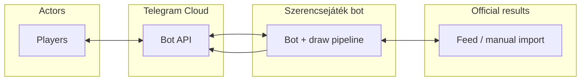
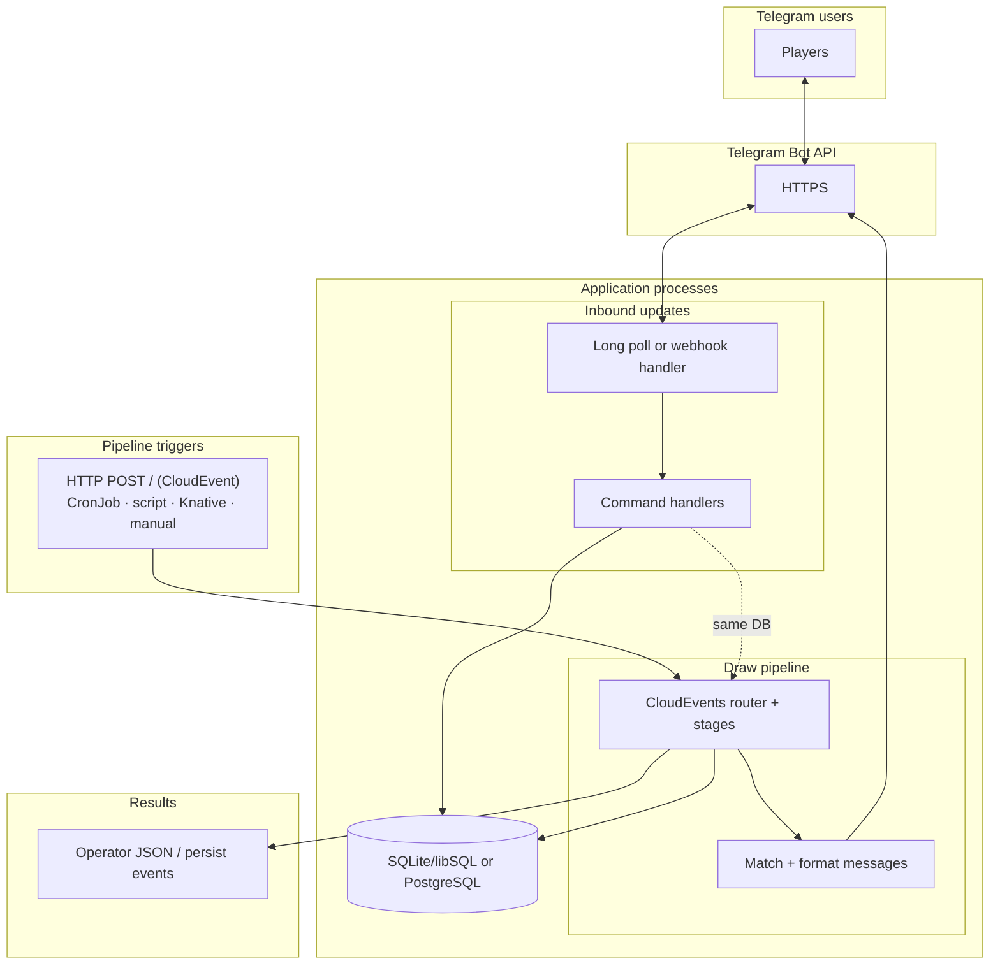
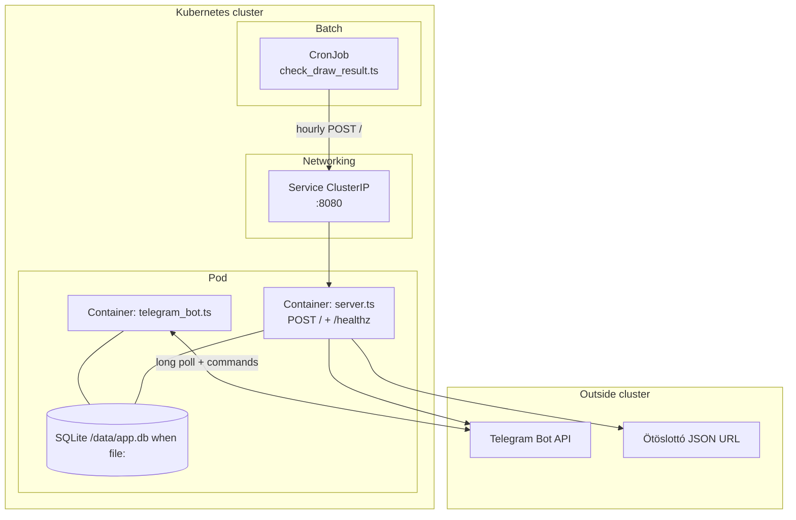
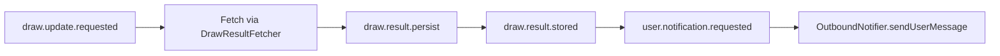

# Architecture — Szerencsejáték Telegram bot

This document is the **high-level design (HLD)** and technical architecture: context, logical
decomposition, pipeline, technology, deployment variants, and layout. **Product rules** live in
[requirements.md](requirements.md); **decision rationale** in [adr/](adr/README.md).

## 1. High-level design (HLD)

### 1.1 System context

Players use **Telegram** to register lines and read results. The bot compares stored lines to
**published** draw results from a configurable source (today: **Ötöslottó** JSON feed). Outbound
messages go back through the **Telegram Bot API**. Draw processing is driven by **CloudEvents** over
HTTP (`POST /`) inside the app; schedulers or operators emit **`draw.update.requested`**.



### 1.2 Logical architecture

**Telegram transport:** updates arrive via **long polling** (`telegram_bot.ts`) and/or **webhook**
(`server.ts` + `WEBHOOK_URL`), never both for the same token except the **Helm longPolling** layout
(one process polls; **`server.ts`** is **internal HTTP only** — see §5). **Handlers** implement
commands; the **draw pipeline** fetches or accepts results, persists, matches, and **notifies** via
`OutboundNotifier`. **Persistence** is Drizzle with either **SQLite/libSQL** (`file:`, `libsql:`,
`https:`, `wss:`) or **PostgreSQL** (`postgres://`, `postgresql://`), selected from `DATABASE_URL`.



### 1.3 Default deployment topology (Helm, `workload.mode: longPolling`)

**No public HTTP** for the app by default (`ingress.enabled: false`). One **Pod** runs two
containers sharing **`/data`**; a **ClusterIP** Service exposes **:8080** to the **pipeline**
container only. A **CronJob** runs hourly and POSTs **`draw.update.requested`** to that Service.



Other packaging options (**`httpServer`**, **Knative**, **Ingress**) are described in **§5**.

See [ADR 0001](adr/0001-cloud-events-pipeline.md) and
[ADR 0003](adr/0003-http-cloudevents-knative.md).

## 2. Components

| Component     | Responsibility                                                                                                                |
| ------------- | ----------------------------------------------------------------------------------------------------------------------------- |
| **Transport** | **Webhook** (`server.ts`), **long polling** (`telegram_bot.ts`), or **Helm default**: both in one Pod (poll + internal HTTP). |
| **Handlers**  | Parse commands (`/start`, `/help`, game-specific flows), validate input, persist lines.                                       |
| **Domain**    | Game definitions (ranges, picks), normalization of lines and draw results, **pure** match functions.                          |
| **Ingestion** | Fetch or import draw results; map to internal `DrawResult` type; deduplicate by `(gameId, drawId)`.                           |
| **Notifier**  | Load subscribers with lines for that draw window; build messages; send via Bot API.                                           |
| **Storage**   | Users, games, lines, processed draws (for idempotency).                                                                       |

## 2.1 Ötöslottó pipeline (CNCF CloudEvents — DX over micro-optimisation)

Steps are **small handlers** connected by **CloudEvents v1.0**-shaped messages
(`src/events/otoslotto_pipeline.ts`). The router is `dispatchPipelineEvent`
(`src/application/dispatch.ts`); `createPipelineEmitter` wires recursive dispatch so each stage can
`emit` the next event.



| Event `type`                        | Action                                                                                  |
| ----------------------------------- | --------------------------------------------------------------------------------------- |
| `...draw.update.requested.v1`       | Fetch latest official numbers → emit **persist** (or no-op if fetch returns nothing).   |
| `...draw.result.persist.v1`         | Insert draw if new (`tryInsertDraw`) → emit **stored** only when inserted (idempotent). |
| `...draw.result.stored.v1`          | List users with lines for `gameId` → emit one **notification** per user.                |
| `...user.notification.requested.v1` | Send one message (`chatId` as string in JSON; convert to `bigint` for Telegram).        |

Manual / CSV flows can **emit `draw.result.persist`** directly (skip fetch). Telegram stays behind
`OutboundNotifier`; other channels add new adapters implementing the same port.

## 3. Key data entities (logical)

- **User**: `telegram_user_id`, `chat_id`, preferences, `created_at`.
- **Subscription / lines**: `game_id`, list of **lines** (sorted unique numbers per line;
  supplementary numbers separated if needed).
- **DrawResult**: `game_id`, `draw_id` (date or official number), winning numbers, optional extras,
  `source`, `ingested_at`.
- **Notification ledger** (optional but recommended): `draw_id` + `user_id` → sent flag for
  idempotent sends.

## 4. Technology choices

| Layer         | Choice                                                                                                                                                                                                                                              |
| ------------- | --------------------------------------------------------------------------------------------------------------------------------------------------------------------------------------------------------------------------------------------------- |
| Runtime       | **Deno** 2.x                                                                                                                                                                                                                                        |
| Language      | **TypeScript**                                                                                                                                                                                                                                      |
| Bot library   | **grammY** (`npm:grammy`); long polling in `src/telegram_bot.ts` — [ADR 0005 § Dependencies](adr/0005-telegram-grammy.md#dependencies).                                                                                                             |
| DB            | **Drizzle ORM** with backend selected from `DATABASE_URL`: **libSQL/SQLite** (`file:`, `libsql:`, `https:`, `wss:`) or **PostgreSQL** (`postgres://`, `postgresql://`) — [ADR 0002 § Dependencies](adr/0002-drizzle-libsql-sqlite.md#dependencies). |
| Events        | **CloudEvents v1.0** shapes internally; inbound HTTP: **`cloudevents`** — [ADR 0003 § Dependencies](adr/0003-http-cloudevents-knative.md#dependencies).                                                                                             |
| HTTP          | `Deno.serve` in `src/server.ts`: `POST /` CloudEvents, `GET /` and `GET /healthz`; `fetch` for Telegram and result APIs.                                                                                                                            |
| Config        | **Zod** validates env at startup (`loadConfig`) — [ADR 0006 § Dependencies](adr/0006-zod-config-and-i18n.md#dependencies).                                                                                                                          |
| i18n          | **`t(locale, key, params)`**; per-locale maps under `src/i18n/locales/` — [ADR 0006](adr/0006-zod-config-and-i18n.md).                                                                                                                              |
| Observability | **OpenTelemetry** (metrics + traces, OTLP/HTTP) when `OTEL_EXPORTER_OTLP_ENDPOINT` is set — [ADR 0007](adr/0007-opentelemetry-metrics-tracing.md); `src/observability/`.                                                                            |
| Logging       | **Structured** logs in `src/logging/` — `LOG_FORMAT=json` (one JSON object per line) or `text`; `LOG_LEVEL`; **`trace_id` / `span_id`** from active OTel span; handler messages `http.handler`, `pipeline.handler`, `telegram.handler` (no PII).    |

Architecture decisions are recorded under [docs/adr/](adr/README.md).

**Persistence:** Drizzle remains the ORM/query layer; runtime backend is selected from
`DATABASE_URL` between libSQL/SQLite and PostgreSQL (trade-offs and dependencies in
[ADR 0002 § Alternatives considered](adr/0002-drizzle-libsql-sqlite.md#alternatives-considered)).

**Events pipeline:** Alternatives (monolithic orchestrator, ad-hoc JSON, brokers, workflow engines)
in [ADR 0001 § Alternatives considered](adr/0001-cloud-events-pipeline.md#alternatives-considered).

**Inbound HTTP & deployment:** Alternatives (hand-rolled CloudEvents parsing, non-CloudEvents JSON,
plain Kubernetes, PaaS) in
[ADR 0003 § Alternatives considered](adr/0003-http-cloudevents-knative.md#alternatives-considered).

**Documentation process:** Alternatives (README-only, wiki, RFCs) in
[ADR 0004 § Alternatives considered](adr/0004-documentation-and-adrs.md#alternatives-considered).
For **new or materially updated architecture ADRs**, follow
[ADR approval workflow](adr/README.md#adr-approval-and-reviewer-name) (ask the user; on approval,
record **Approved by** and **Approved at** (UTC ISO timestamp) in the ADR **Review** section).

**Pinned dependencies:** See [ADR index — Dependency inventory](adr/README.md#dependency-inventory).

## 5. Deployment modes

- **Helm defaults (`knative.enabled: false`, `workload.mode: longPolling`,
  `ingress.enabled: false`):** one **Pod** with **`telegram_bot.ts`** (long polling) and
  **`server.ts`** (internal HTTP only — **ClusterIP** Service, no public ingress). A **CronJob**
  runs hourly (`scripts/check_draw_result.ts`) and POSTs the draw pipeline to the in-cluster
  Service. SQLite **`/data`** is shared by both containers. Enable **`ingress`** and
  **`config.webhookUrl`** only if you need a public Telegram webhook instead of long polling. See
  **§1.3** and
  [deploy/helm/szerencsejatek-telegram-bot/README.md](../deploy/helm/szerencsejatek-telegram-bot/README.md).
- **Telegram + scale-to-zero (recommended for Knative):** **`src/server.ts`** serves **Telegram
  webhooks** at **`POST ${TELEGRAM_WEBHOOK_PATH}`** (default **`/telegram/webhook`**) via grammY
  **`webhookCallback(..., "std/http")`**. Set **`WEBHOOK_URL`** (public **HTTPS** base, no trailing
  slash) and optionally **`TELEGRAM_WEBHOOK_SECRET`** so Telegram can POST updates while the
  revision is scaled to zero between requests. See [ADR 0005](adr/0005-telegram-grammy.md).
- **Long polling:** **`src/telegram_bot.ts`** — no public URL needed; calls **`deleteWebhook`**
  before polling so it does not fight **`server.ts`** webhooks when the **same** process or another
  client has registered a webhook. In **Helm** long-polling mode, the polling container clears the
  webhook while the **`server.ts`** sidecar serves **ClusterIP-only** HTTP (no public webhook URL).
- **CloudEvents:** same **`server.ts`** — **`POST /`** for pipeline CloudEvents (`cloudevents` SDK).
- **Deno Cron (optional):** set **`CRON_RESULT_CHECK_ENABLED=true`** to register an in-process
  **hourly** scheduler (`0 * * * *`) in `server.ts` that emits `draw.update.requested` internally.
  Default is off.
- **Knative Serving**: one Service can handle **both** Telegram webhooks and CloudEvents; **scale to
  zero** works when idle (no long-lived polling loop). **Knative Eventing** (Broker + Trigger) can
  deliver CloudEvents to that Service. See [deploy/kind/README.md](../deploy/kind/README.md).

## 6. Security

- Token: `BOT_TOKEN` env only.
- Webhook: set **`TELEGRAM_WEBHOOK_SECRET`** and pass it to **`setWebhook`**; grammY validates
  **`X-Telegram-Bot-Api-Secret-Token`**. Use HTTPS only for webhook URL (Telegram requirement).
- Rate limiting: per-user command frequency for expensive operations (optional).

## 7. Directory layout

```
src/
  server.ts                  # HTTP entry: CloudEvents POST, health (container / Knative)
  telegram_bot.ts            # Telegram long polling (grammY); see ADR 0005
  telegram/                  # grammY handlers; maps domain errors to i18n (see ADR 0006)
  i18n/                      # locales + translate (`t`)
  config/                    # env schema (Zod) + loadConfig
  observability/             # OpenTelemetry init, metrics instruments (ADR 0007)
  logging/                   # structured logger (text | JSON), handler call logs
  main.ts                    # exports composition root helpers
  application/               # pipeline handlers + dispatch + message formatting
  domain/                    # game rules, matching (pure)
  events/                    # CloudEvents types + Ötöslottó pipeline constants
  ports/                     # interfaces (repositories, notifier, fetcher, emit)
  adapters/
    http/                    # CloudEvents request parsing
    persistence/drizzle/     # Drizzle + libSQL/SQLite backend
    persistence/drizzle_postgres/ # Drizzle + postgres-js backend
    notify/                  # OutboundNotifier (noop or Telegram)
    ingestion/               # DrawResultFetcher implementations
tests/                       # e2e (kind) when E2E_KIND=1
docs/
  adr/                       # architecture decision records (index: adr/README.md)
deploy/
  docker/                    # Dockerfile
  helm/szerencsejatek-telegram-bot/  # Helm: longPolling | httpServer | Knative; optional CronJob (draw checks)
  knative/                   # Service, optional Broker/Trigger samples (reference YAML)
```

## 8. Risks and mitigations

| Risk                    | Mitigation                                                                                |
| ----------------------- | ----------------------------------------------------------------------------------------- |
| Operator feed changes   | **`OTOSLOTTO_RESULT_JSON_URL`** override (default: `cmsfiles/otos.html`); parse errors logged; pipeline skips on failure. |
| Rule complexity (tiers) | Ship **hit counts** first; add tier tables per game in domain layer.                      |
| Duplicate notifications | Persist processed `(game, draw)` and notification ledger.                                 |
